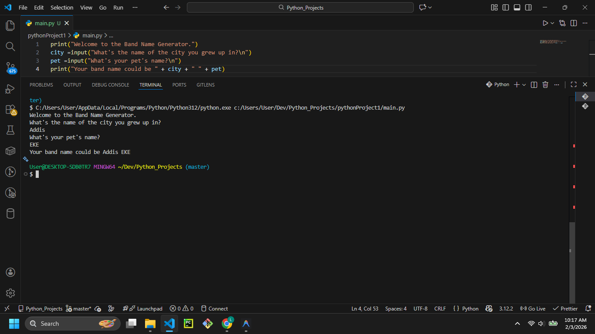

# Band Name Generator



## Description

Welcome to the **Band Name Generator**! This is a simple yet fun Python project that helps you come up with a cool name for your band. It works by taking two inputs from the user:
1. The city they grew up in.
2. The name of their pet.

It then combines these two pieces of information to generate a unique band name.

## Features

- Interactive command-line interface.
- Simple string manipulation and concatenation.
- Beginner-friendly Python logic.

## Prerequisites

- Python 3.x installed on your system.

## How to Run

1. Open your terminal or command prompt.
2. Navigate to the project directory:
   ```bash
   cd path/to/BandName
   ```
3. Run the script:
   ```bash
   python main.py
   ```

## Example Usage

```text
Welcome to the Band Name Generator.
What's the name of the city you grew up in?
Bristol
What's your pet's name?
Rabbit
Your band name could be Bristol Rabbit
```

## Contributing

Feel free to fork this repository and improve the logic! You could add more questions or random adjectives to make the names even more creative.
