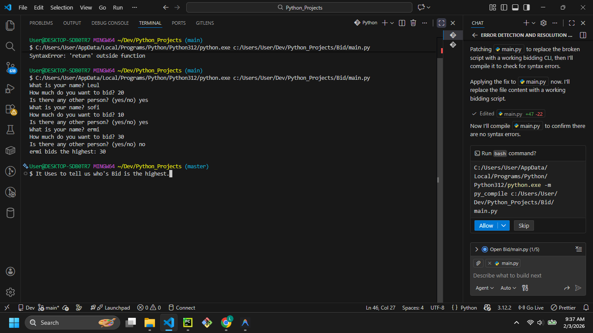

# Blind Bidding Program



## Description

Welcome to the **Blind Bidding Program**! This Python script allows multiple users to place "blind" bids in a loop. Once all participants have placed their bids, the program automatically calculates and announces the highest bidder.

## Features

- **Input Validation:** Ensures names are not empty and bid amounts are valid numbers.
- **Dynamic Bidding Loop:** Continues asking for bidders until the user indicates there are no more.
- **Automatic Winner Calculation:** Determines the maximum bid and displays the winner.

## Prerequisites

- Python 3.x installed on your system.

## How to Run

1. Open your terminal or command prompt.
2. Navigate to the project directory:
   ```bash
   cd path/to/Bid
   ```
3. Run the script:
   ```bash
   python main.py
   ```

## Example Usage

```text
What is your name? Alice
How much do you want to bid? 150
Is there any other person? (yes/no) yes

What is your name? Bob
How much do you want to bid? 300
Is there any other person? (yes/no) no

Bob bids the highest: 300
```

## Contributing

Feel free to fork this repository and add features like:
- Clearing the screen between bids (to make it truly "blind").
- Storing bid history.
- Handling tie-breaking logic.
