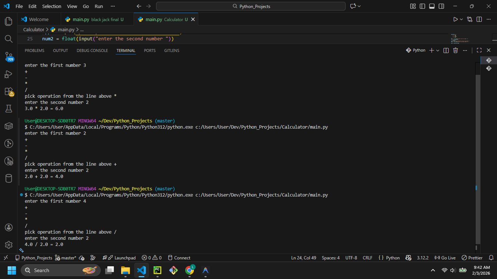

# Simple Calculator



## Description

Welcome to the **Simple Calculator**! This Python script performs basic arithmetic operations. It prompts the user for two numbers and an operator, then calculates and displays the result.

## Features

- **Supported Operations:**
  - Addition (`+`)
  - Subtraction (`-`)
  - Multiplication (`*`)
  - Division (`/`)
- **Dictionary-based Dispatch:** Uses a Python dictionary to map operator strings to functions.

## Prerequisites

- Python 3.x installed on your system.

## How to Run

1. Open your terminal or command prompt.
2. Navigate to the project directory:
   ```bash
   cd path/to/Calculator
   ```
3. Run the script:
   ```bash
   python main.py
   ```

## Example Usage

```text
enter the first number 10
+
-
*
/
pick operation from the line above *
enter the second number 5
10.0 * 5.0 = 50.0
```

## Contributing

Feel free to fork this repository and expand the project! Ideas for improvement:
- Add a `while` loop to optimize for multiple calculations.
- Support more complex mathematical operations (exponents, roots).
- Add error handling for division by zero.
