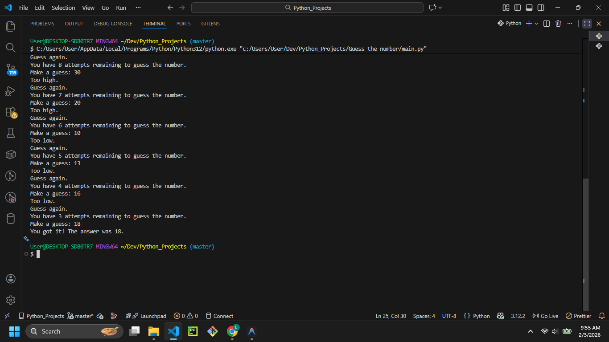

# Guess The Number



> **Note:** Replace `Guess-The-Number.png` with the actual path to your screenshot or project image.

## Description

Welcome to **Guess The Number**! In this Python command-line game, the computer randomly selects a number between 1 and 100, and your objective is to guess it correctly. You can choose your difficulty level, which determines how many attempts you have.

## Features

- **Difficulty Levels:**
  - **Easy:** 10 attempts to guess the number.
  - **Hard:** 5 attempts to guess the number.
- **Feedback:** The game tells you if your guess is "Too high" or "Too low".
- **Input Validation:** Handles non-integer inputs gracefully.

## Prerequisites

- Python 3.x installed on your system.

## How to Run

1. Open your terminal or command prompt.
2. Navigate to the project directory:
   ```bash
   cd "path/to/Guess the number"
   ```
3. Run the script:
   ```bash
   python main.py
   ```

## Example Usage

```text
Welcome to 'Guess The Number'!
I'm thinking of a number between 1 and 100.
you want easy or hard? easy
You have 10 attempts remaining to guess the number.
Make a guess: 50
Too high.
Guess again.
You have 9 attempts remaining to guess the number.
Make a guess: 25
Too low.
Guess again.
...
You got it! The answer was 42.
```

## Contributing

Feel free to fork this repository and add new features! Some ideas:
- Add a "Medium" difficulty.
- Keep track of high scores (fewest guesses to win).
- Allow the user to choose the range (e.g., 1-1000).
