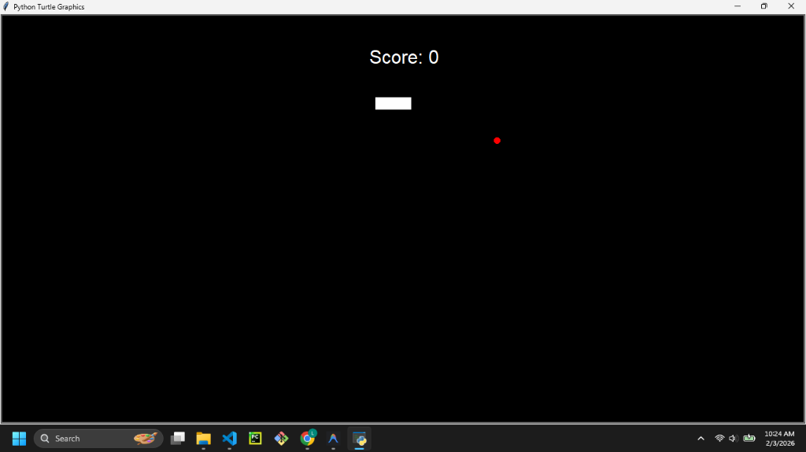
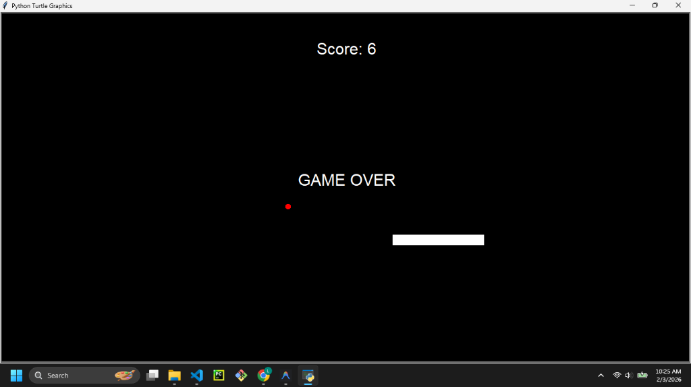

# Snake Game




## Description

This is a classic **Snake Game** implementation using Python's `turtle` graphics library. The player controls a snake that grows longer as it eats food, while avoiding collisions with the walls and its own tail.

## Features

- **Smooth Animation:** Uses screen tracing for fluid movement.
- **Scoreboard:** Tracks the current score in real-time.
- **Game Over Detection:** Detects collisions with walls and the snake's own body.
- **OOP Architecture:** Code is organized into classes (`Snake`, `Food`, `Scoreboard`) for better modularity.

## Prerequisites

- Python 3.x installed on your system.

## How to Run

1. Open your terminal or command prompt.
2. Navigate to the project directory:
   ```bash
   cd "path/to/Snake game"
   ```
3. Run the script:
   ```bash
   python main.py
   ```

## Controls

- **Up Arrow:** Move Up
- **Down Arrow:** Move Down
- **Left Arrow:** Move Left
- **Right Arrow:** Move Right

## Contributing

Feel free to fork this repository! Some ideas for features:
- Add a high score system that persists to a file.
- Add different difficulty levels (speed changes).
- Add obstacles or power-ups.
