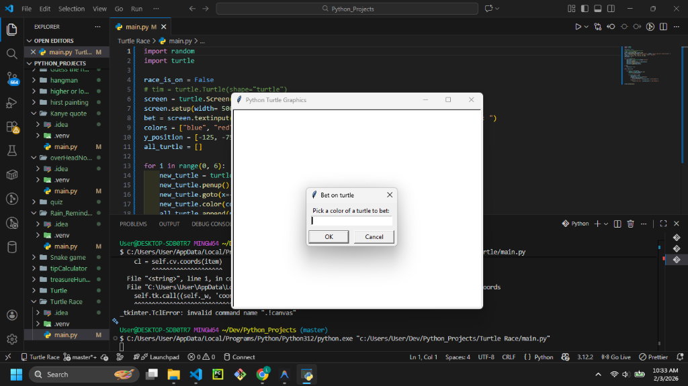
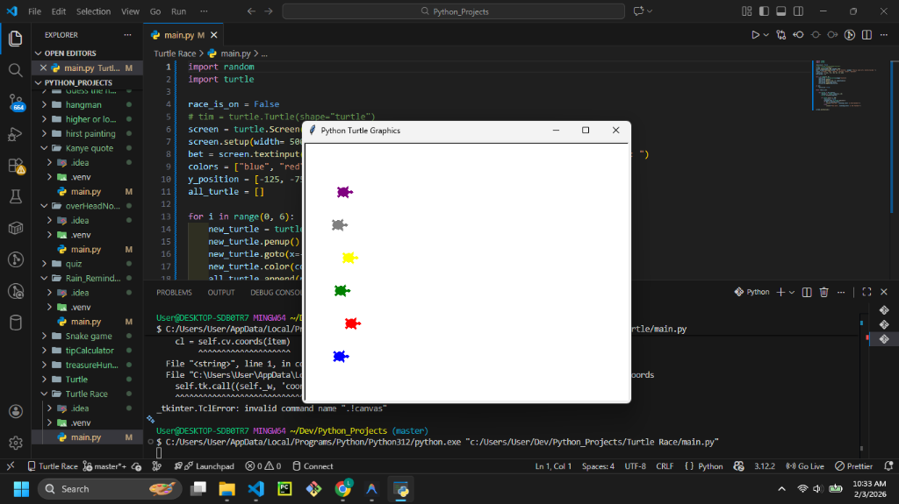
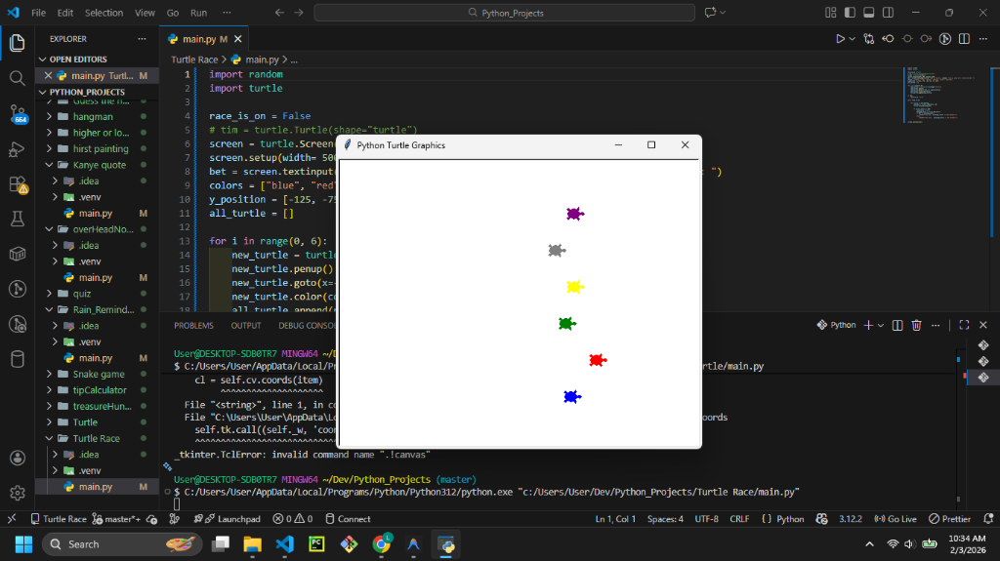

# Turtle Race







## Description

The **Turtle Race** is an exciting graphical simulation built with the Python `turtle` module. It features 6 colorful turtles racing across the screen. Before the race begins, the user places a bet on which color they think will win.

## Features

- **Betting System:** A popup window asks for your prediction/bet.
- **Randomized Movemrnt:** Each turtle moves a random distance forward in each loop, making the outcome unpredictable.
- **Race Logic:** The script continuously checks if any turtle has crossed the finish line.
- **Win/Loss Analysis:** Compares the winner to your bet and announces the result in the console.

## Prerequisites

- Python 3.x installed on your system.
- `turtle` module (standard in Python).

## How to Run

1. Open your terminal or command prompt.
2. Navigate to the project directory:
   ```bash
   cd "path/to/Turtle Race"
   ```
3. Run the script:
   ```bash
   python main.py
   ```
4. A window will pop up. Type the color of the turtle you want to bet on (e.g., "red", "blue", "green", "yellow", "purple", "grey").
5. Watch the race! The result will be printed in your terminal.

## Contributing

Feel free to fork this repository! potential improvements:
- Add a visual finish line.
- Display the winner on the graphics screen instead of just the console.
- Keep track of a "bankroll" for betting over multiple races.
