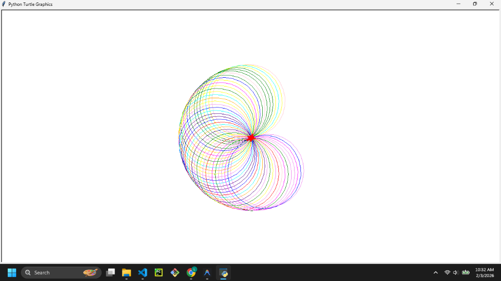
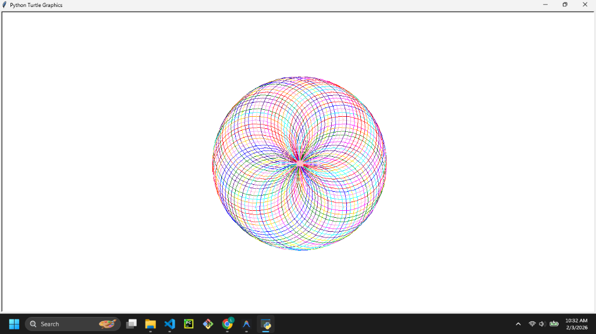

# Turtle Spirograph




## Description

This project demonstrates the capabilities of the Python `turtle` module by generating beautiful, multi-colored Spirograph patterns. The turtle draws a series of circles with a slight angular shift each time, creating a mesmerizing geometric design.

## Features

- **Automated Drawing:** The turtle runs a loop to draw many circles.
- **Random Colors:** Each circle is drawn in a randomly selected color from a predefined palette (Red, Orange, Yellow, Green, Blue, Indigo, Violet, Pink, Cyan, Magenta).
- **Customizable:** You can easily adjust the "gap" size (angle shift) to make the spirograph tighter or looser.

## Prerequisites

- Python 3.x installed on your system.
- `turtle` module (standard in Python).

## How to Run

1. Open your terminal or command prompt.
2. Navigate to the project directory:
   ```bash
   cd path/to/Turtle
   ```
3. Run the script:
   ```bash
   python main.py
   ```
   
   Watch the turtle draw! Click the window to exit when finished.

## Contributing

Feel free to fork this repository! potential improvements:
- Implement full RGB random colors (currently commented out in the code).
- Add user input to define the circle radius or shift angle.
- Save the final drawing as an image file.
