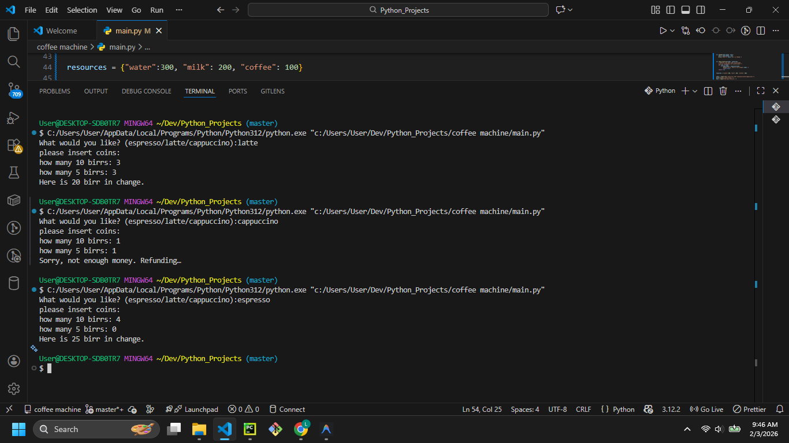

# Coffee Machine



## Description

Welcome to the **Coffee Machine** program! This Python script simulates a digital coffee machine interaction. Users can choose from a menu of drinks (Espresso, Latte, Cappuccino), insert coins (in Birr), and receive their beverage if they have provided enough money.

## Features

- **Menu Options:** 
  - Espresso (15 Birr)
  - Latte (25 Birr)
  - Cappuccino (30 Birr)
- **Currency Handling:** Accepts 10 Birr and 5 Birr notes/coins and calculates change.
- **Resource Checking:** (Logic included for checking water, milk, and coffee levels).

## Prerequisites

- Python 3.x installed on your system.

## How to Run

1. Open your terminal or command prompt.
2. Navigate to the project directory:
   ```bash
   cd "path/to/coffee machine"
   ```
3. Run the script:
   ```bash
   python main.py
   ```

## Example Usage

```text
What would you like? (espresso/latte/cappuccino): latte
please insert coins: 
how many 10 birrs: 3
how many 5 birrs: 0
Here is 5 birr in change.
```

## Contributing

Feel free to fork this repository! Some ideas for improvements:
- Integrate the resource deduction logic (water, milk, coffee) when a drink is made.
- Add a loop to serve multiple customers.
- Add a "report" command to see current resource levels.
