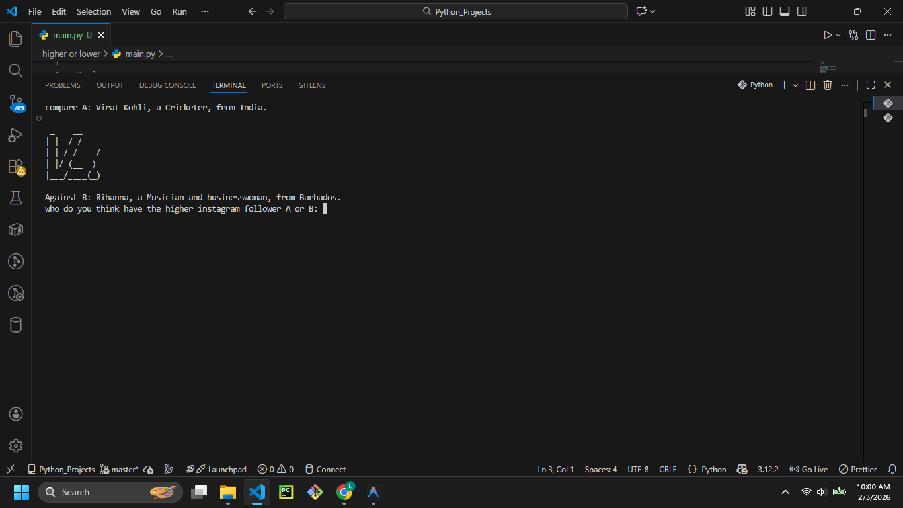
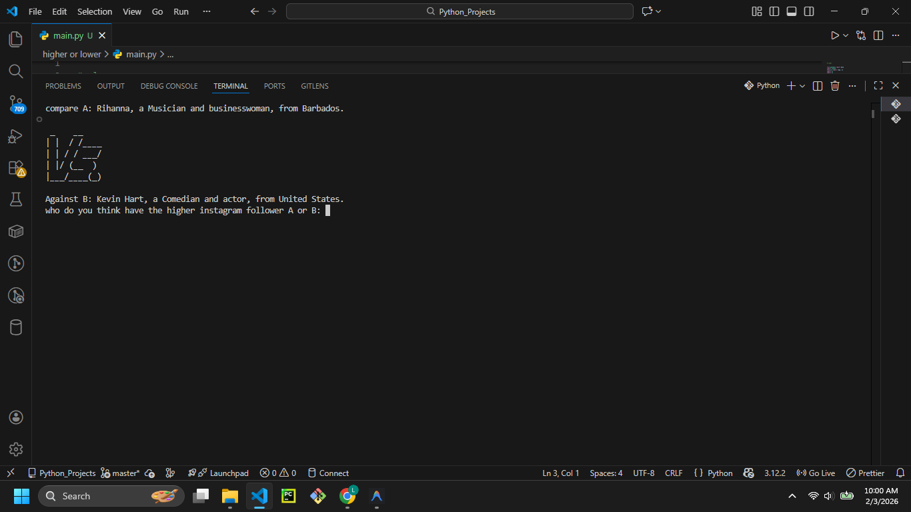
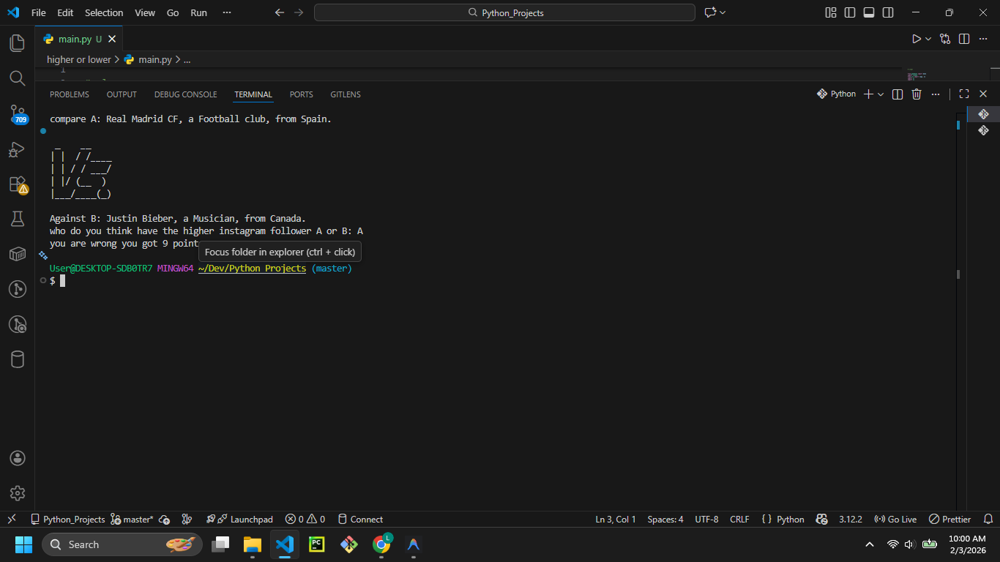

# Higher or Lower Game





## Description

Welcome to the **Higher or Lower Game**! In this Python console game, you compare two famous people, brands, or entities and guess which one has more Instagram followers.

## Features

- **Random Comparisons:** Pulls data from a large list of entities (celebrities, brands, etc.).
- **Score Tracking:** Keeps track of your current streak.
- **Game Over Logic:** one wrong guess and the game ends, displaying your final score.
- **Visuals:** Includes ASCII art for the logo and "VS" symbol.

## Prerequisites

- Python 3.x installed on your system.
- `gamedata.py` (contains the game data)
- `art.py` (contains the ASCII art)

## How to Run

1. Open your terminal or command prompt.
2. Navigate to the project directory:
   ```bash
   cd "path/to/higher or lower"
   ```
3. Run the script:
   ```bash
   python main.py
   ```

## Example Usage

```text
compare A: Neymar, a Footballer, from Brasil.
 _    __    
| |  / /____
| | / / ___/
| |/ (__  ) 
|___/____/  

Against B: Ariana Grande, a Musician and actress, from United States.
who do you think have the higher instagram follower A or B: B
you are right, your score is 1
```

## Contributing

Feel free to fork this repository! Ideas for improvement:
- Expand the `gamedata.py` dataset.
- Add a high-score system that saves to a file.
- Add difficulty levels (e.g., closer follower counts).
