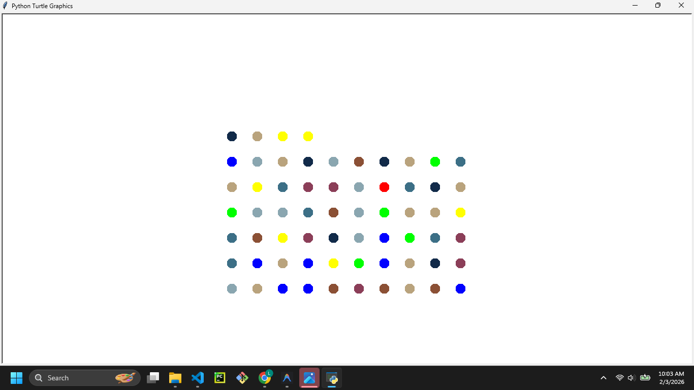
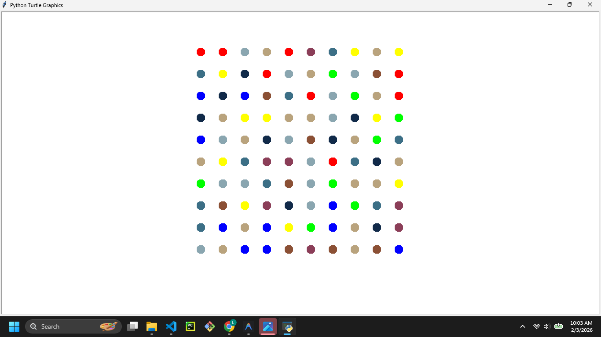

# Hirst Painting Generator

 
 


## Description

This project uses Python's `turtle` module to generate a spot painting inspired by Damien Hirst. It draws a grid of random colored dots on the screen.

## Features

- **Turtle Graphics:** Uses the standard `turtle` library for drawing.
- **Random Colors:** Selects colors randomly from a predefined palette of RGB values.
- **Grid Layout:** Automatically positions the dots in a neat grid pattern.

## Prerequisites

- Python 3.x installed on your system.
- `turtle` module (usually included with standard Python installations).

## How to Run

1. Open your terminal or command prompt.
2. Navigate to the project directory:
   ```bash
   cd "path/to/hirst painting"
   ```
3. Run the script:
   ```bash
   python main.py
   ```
   
   A window will open showing the painting process. Click on the window to exit once it's done.

## Contributing

Feel free to fork this repository! potential improvements:
- Use `colorgram` to extract colors from an actual image.
- Allow user input for grid size and dot size.
- Save the final result to an image file automatically.
