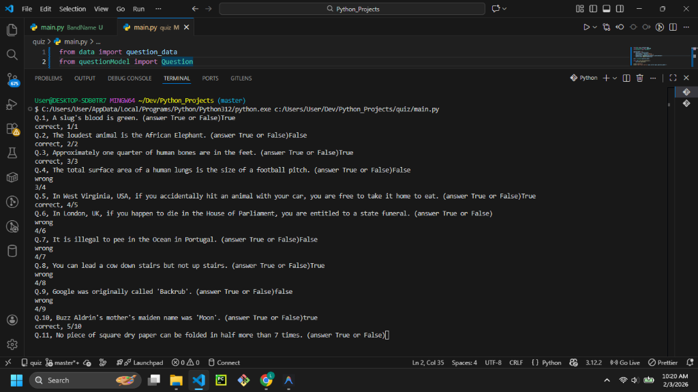

# Quiz Game



## Description

Welcome to the **Quiz Game**! This is a text-based trivia game built with Python. It uses Object-Oriented Programming (OOP) principles to manage questions and game flow. 

The game presents a series of questions to the user, who must answer "True" or "False". It tracks the current score and provides instant feedback after each answer.

## Features

- **OOP Design:** Separates logic into `Question`, `QuizBrain`, and `main` modules.
- **Score Tracking:** Keeps a running tally of your score throughout the game.
- **Dynamic Question Bank:** Loads questions easily from a data source.
- **Input Validation:** Simple True/False checking.

## Project Structure

- `main.py`: The entry point of the application. Sets up the question bank and starts the quiz loop.
- `questionModel.py`: Defines the `Question` class structure.
- `quizBrain.py`: Contains the `QuizBrain` class, which handles the game logic (checking answers, moving to the next question, tracking score).
- `data.py`: Stores the list of questions and answers.

## Prerequisites

- Python 3.x installed on your system.

## How to Run

1. Open your terminal or command prompt.
2. Navigate to the project directory:
   ```bash
   cd path/to/quiz
   ```
3. Run the script:
   ```bash
   python main.py
   ```

## Example Usage

```text
Q.1, A slug's blood is green. (answer True or False): True
You got it right!
The correct answer was: True.
Your current score is: 1/1

Q.2, The loudest animal is the African Elephant. (answer True or False): False
You got it right!
The correct answer was: False.
Your current score is: 2/2
...
complete!
your final score is 10/12
```

## Contributing

Feel free to fork this repository! potential improvements:
- Fetch questions from an online API (like Open Trivia Database).
- Add support for multiple choice questions.
- Create a UI using Tkinter.
