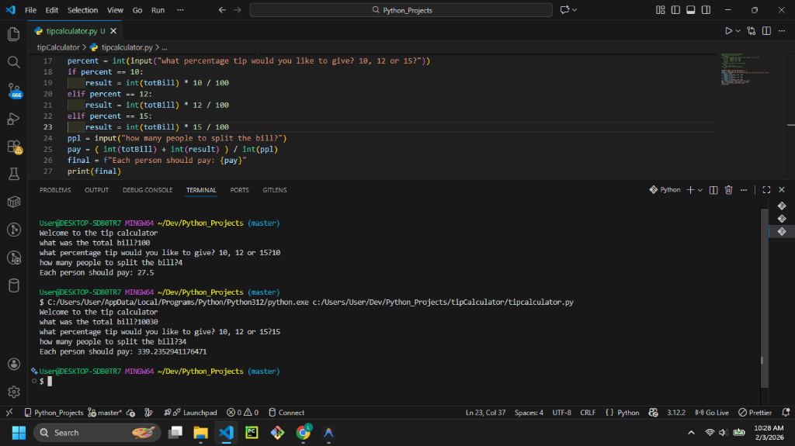

# Tip Calculator



## Description

The **Tip Calculator** is a simple Python script that helps you calculate how much each person needs to pay when splitting a bill. It takes into account the total bill amount, the desired tip percentage, and the number of people sharing the cost.

## Features

- **Tip Options:** Supports standard tip percentages (10%, 12%, or 15%).
- **Split Calculation:** Automatically divides the total (bill + tip) by the number of people.
- **User-Friendly Output:** Displays the exact amount each individual owes.

## Prerequisites

- Python 3.x installed on your system.

## How to Run

1. Open your terminal or command prompt.
2. Navigate to the project directory:
   ```bash
   cd path/to/tipCalculator
   ```
3. Run the script:
   ```bash
   python tipcalculator.py
   ```

## Example Usage

```text
Welcome to the tip calculator
what was the total bill? 150
what percentage tip would you like to give? 10, 12 or 15? 12
how many people to split the bill? 5
Each person should pay: 33.6
```

## Contributing

Feel free to fork this repository! potential improvements:
- Allow custom tip percentages (any number).
- Add error handling for non-numeric inputs.
- Round the final result to 2 decimal places for better currency formatting.
