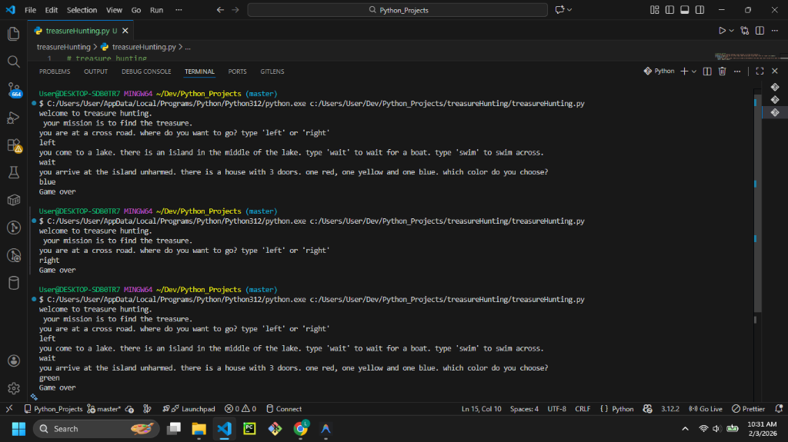

# Treasure Hunting



## Description

**Treasure Hunting** is a text-based adventure game written in Python. The player embarks on a mission to find a hidden treasure by making a series of choices at different locations (a crossroad, a lake, a house). Each choice leads to either continuing the journey or a "Game Over".

## Features

- **Interactive Storytelling:** The user inputs text commands (`left`, `right`, `swim`, `wait`, etc.) to progress.
- **Conditional Logic:** Nested `if-else` statements determine the outcome of each decision.
- **Win/Loss States:** Several ways to lose, but only one specific path leads to the treasure (Yellow Door!).

## Prerequisites

- Python 3.x installed on your system.

## How to Run

1. Open your terminal or command prompt.
2. Navigate to the project directory:
   ```bash
   cd path/to/treasureHunting
   ```
3. Run the script:
   ```bash
   python treasureHunting.py
   ```

## Example Usage

```text
welcome to treasure hunting.
 your mission is to find the treasure.
you are at a cross road. where do you want to go? type 'left' or 'right' 
left
you come to a lake. there is an island in the middle of the lake. type 'wait' to wait for a boat. type 'swim' to swim across.
wait
you arrive at the island unharmed. there is a house with 3 doors. one red, one yellow and one blue. which color do you choose?
yellow
YOU WIN!
```

## Contributing

Feel free to fork this repository! You could expand the story by:
- Adding more levels and choices.
- Implementing a "health" system or inventory.
- Randomizing the correct path each time the game runs.
